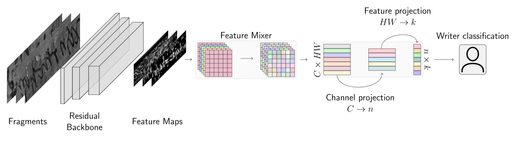
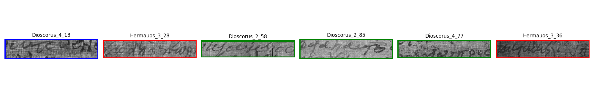
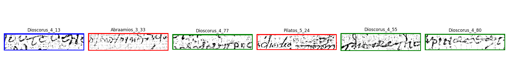

# hip23
Code for our paper 

Marco Peer and Robert Sablatnig: **Feature Mixing for Writer Retrieval and Identification on Papyri Fragments** at HIP@ICDAR2023. Additional data is available [here](https://github.com/marco-peer/hip23-data). [Paper](https://arxiv.org/abs/2306.12939)

## Overview

  

## Installation

Install the packages via

    pip install -r requirements.txt

The repository uses wandb for logging.

## Running

The main script for training and testing the PapyRow dataset is 

    python main_classification.py --config config/config_papyrow_classification.yml --gpuid=GPUID 

By default, it will run k-fold cross-validation with the split defined in config/papyri_split.yml. If interested, you can simply change the validation split.

To train our model on the HisFrag20 dataset, we used the triplet loss. This training can be started via

    python main_triplet.py --config config/config.yml

## Inference

To reproduce our results, an inference script can be executed via

    python inference.py --mode='color' --src_path=SOURCE

where mode represents **color**, **sauvola** or **unet**, and src_path refers to the source directory, structured as our provided [data repository](https://github.com/marco-peer/hip23-data).

## Visualize retrieval

There is also a retrieval script where a query is given by a used and it visualizes the top 5 papyri fragments, executed by

    python retrieve.py --src_path=SOURCE --mode='color --query='Dioscorus_4_13' --save_path=OUTPUT_PATH

The query is currently identified by its filename. It will output an image, e.g.

  
  
  

## Contact
In case you have questions or find some errors, do not hesitate to contact me mpeer(at)cvl.tuwien.ac.at.

## References
Please consider citing our paper if you find it helpful

    @InProceedings{Peer_2023_HIP,
        author    = {Peer, Marco and Sablatnig, Robert},
        title     = {Feature Mixing for Writer Retrieval and Identification on Papyri Fragments},
        booktitle = {accepted for presentation at HIP@ICDAR2023: 7th International Workshop on Historical Document Imaging and Processing},
        month     = {August},
        year      = {2023},
    }

